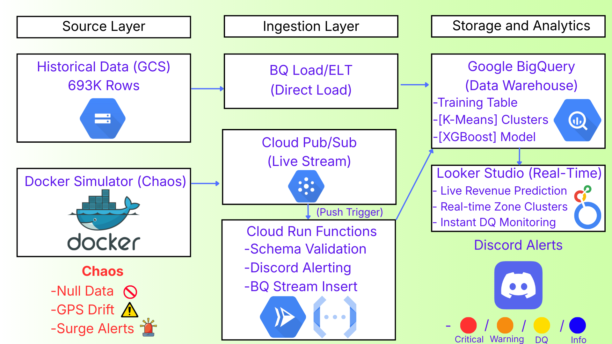
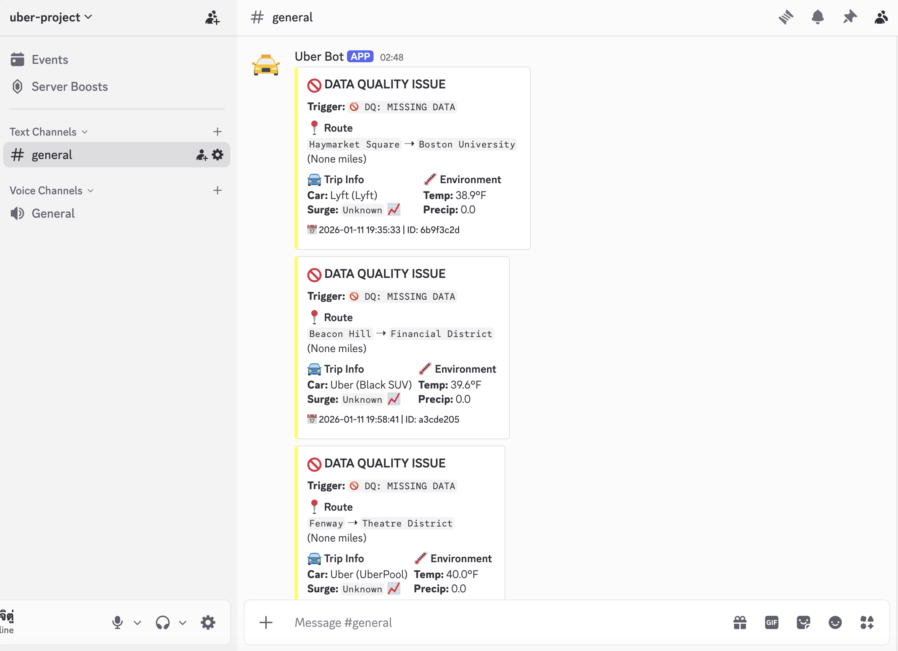

# Serverless Streaming & Batch Pipeline for Ride-Hailing 🚖


## 📖 1. Overview

This project demonstrates an **End-to-End Real-time Data Platform** by transforming the static **Uber & Lyft Kaggle Dataset (Boston, MA)** into a dynamic, streaming event source.

Instead of simply loading a CSV into a database, I engineered a **Dockerized Python Simulator** that "replays" the dataset as live traffic across Boston neighborhoods. This approach allows for a realistic simulation of a ride-hailing environment to test a **Lambda Architecture** on Google Cloud Platform.

**Key Components:**
* **Data Source:** **Dockerized Python** simulator replaying ride patterns across Boston (e.g., Fenway, Back Bay).
* **Ingestion Layer:** Real-time streaming via **Pub/Sub** triggered by **Cloud Run functions** for serverless data ingestion.
* **Storage Layer:** Hybrid storage using **Cloud Storage (GCS)** for batch historical data and **BigQuery** for the data warehouse.
* **Analytics Engine:** Utilizes **BigQuery ML** (XGBoost & K-Means) to predict pricing and cluster locations dynamically.
* **Monitoring & Alerting:** Automated checks triggering real-time alerts to **Discord** for Data Quality anomalies and Business events.
* **Visualization:** Interactive **Looker Studio** dashboard for real-time monitoring of revenue, ride volume, and model performance.

---

## 🏗️ 2. System Architecture


*(The diagram above illustrates the Lambda Architecture implemented on GCP)*

This pipeline is designed to handle high-throughput ride data using a **Lambda Architecture**, splitting the workflow into a **Speed Layer** (Real-time) and a **Batch Layer** (Historical).

### 1. Data Source & Simulation (The "Chaos" Generator)
* **Dataset:** Logic derived from the Uber & Lyft Dataset (Boston, MA).
* **Dockerized Simulator:** A Python application that streams ride events to Pub/Sub. **Note:** The simulator generates all ride features (Distance, Weather, Surge) *except* the final price, which is predicted by our ML model.
* **Chaos Engineering:** The script intentionally injects **Data Quality (DQ)** issues based on probability:
    * **Missing Data:** Randomly sets `distance` or `surge_multiplier` to `NULL` (2% probability).
    * **GPS Drift:** Generates unlikely distances (Too Short/Long) relative to the Boston route map.

### 2. Speed Layer (Real-time Ingestion)
* **Ingestion:** Ride events are streamed to **Pub/Sub**.
* **Processing:** **Cloud Run functions** validate the payload and insert it into **BigQuery** immediately.
* **Error Handling (DLQ):** To ensure zero data loss, any message that fails processing (e.g., malformed JSON) is automatically routed to a **Dead Letter Topic** (`uber-ride-dead-letter`) for later inspection.
* **Monitoring & Alerting:** The function parses the `alert_trigger` field and sends **Discord Webhooks** for:
    * **⛔ Data Quality Errors:** `DQ: MISSING DATA` (Null inputs), `DQ: SHORT` (GPS Errors).
    * **⚡ Critical Events:** `STORM STARTED`, `FREEZE STARTED`, and **High Demand Surges** (triggered by `RUSH HOUR` or `HOT ZONE`).

### 3. Batch Layer (Model Training)
* **Storage:** Historical data (containing actual prices) is archived in **Google Cloud Storage (GCS)**.
* **Training:** We load this data into BigQuery to train:
    * **XGBoost Regressor:** Trains a pricing model using distance, surge, temperature, and the geospatial zones (cluster_id) derived from the K-Means model and more as key features.
    * **K-Means Clustering:** To group coordinates into 6 distinct spatial zones across the city.

### 4. Serving & Visualization
* **Inference:** The trained XGBoost model predicts the `fare_price` for every incoming real-time record.
* **Dashboard:** **Looker Studio** joins the real-time stream with model predictions to visualize **Actual Revenue vs. Predicted Price** and monitor system health.

---

## 🛠️ 3. Tech Stack & Tools

This project leverages a fully serverless Google Cloud stack, orchestrating data flow from a Dockerized container to a BI dashboard.

| Category | Technology | Usage in Pipeline |
| :--- | :--- | :--- |
| **Infrastructure** |  | Containerized environment for the Python Simulator to ensure reproducible chaos experiments. |
| **Cloud Platform** |  | Primary ecosystem for all data engineering and analytics services. |
| **Streaming** | **Cloud Pub/Sub** | Handles high-throughput events. Includes a **Dead Letter Topic** (`uber-ride-dead-letter`) to catch failed messages. |
| **Compute** | **Cloud Run functions** | Serverless functions (Gen 2) for payload validation, parsing, and BigQuery insertion. |
| **Data Warehouse** | **BigQuery** | Petabyte-scale data warehouse for storing raw streams (`simulation_rides`) and 600K+ historical records. |
| **Machine Learning** | **BigQuery ML** | **XGBoost** (Regression) for fare prediction (evaluated via MAE/MAPE) and **K-Means** for spatial clustering (Zones 1-6). |
| **Language** | **Python 3.9+** | Core logic for the simulator, random anomaly generation, and Cloud Run function code. |
| **Visualization** | **Looker Studio** | Interactive dashboards for Operation Monitoring, Revenue Forecasting, and Data Quality Analysis. |
| **Alerting** | **Discord Webhook** | Real-time notification channel for critical events (`RUSH HOUR`, `STORM`) and data anomalies (`MISSING DATA`). |

---
## 4. 💾 Dataset & Schema Design

### Source Data
The project utilizes the **[Uber and Lyft Dataset Boston, MA](https://www.kaggle.com/datasets/brllrb/uber-and-lyft-dataset-boston-ma)** from Kaggle.
* **Dataset Size:** ~693,071 rows with 57 columns.
* **Scope:** Ride-hailing data covers various locations in Boston (e.g., Back Bay, Fenway, North Station).
* **Preprocessing:**
    * **Batch Layer:** Cleaned raw CSV by removing rows with null prices to create a high-quality training set.
    * **Streaming Layer:** The simulator streams critical features (Source, Destination, Cab Type, Weather) but **excludes the price** to simulate a prediction scenario.

### BigQuery Schema
Data lands in BigQuery with the following unified schema.

| Field Name | Type | Description |
| :--- | :--- | :--- |
| `ride_id` | STRING | **Primary Key** used for **De-duplication** (Ensures exactly-once processing). |
| `timestamp` | TIMESTAMP | Event time of the ride request. |
| `cab_type` | STRING | Service provider (`Uber` or `Lyft`). |
| `name` | STRING | Specific car class (e.g., `UberXL`, `Lux Black`). |
| `source` | STRING | Pickup location (e.g., `Fenway`, `North Station`). |
| `destination` | STRING | Drop-off location. |
| `distance` | FLOAT | Distance in miles. |
| `surge_multiplier` | FLOAT | Pricing multiplier based on demand. |
| `temperature` | FLOAT | Temperature in Fahrenheit. |
| `precipIntensity` | FLOAT | Rain/Snow intensity. |
| `alert_trigger` | STRING | Tags for anomalies (e.g., `DQ: SHORT`, `RUSH HOUR`). |
| `price` | FLOAT | Actual fare price (Null for stream, populated for batch). |

---

## 🧬 5. Simulation Logic & Chaos Engineering

To simulate a realistic production environment, I engineered a **State-Aware Python Simulator** running in Docker.

### 🧠 1. Operational Logic & Weather States
The simulator follows a state machine where weather conditions directly impact `precipIntensity` and `temperature`, which in turn feed into the ML price prediction model.

| Icon | State | Condition (Logic) | Note |
| :--- | :--- | :--- | :--- |
| ☀️ | **CLEAR** | Precip = 0 | Default state for normal operations. |
| 🌧️ | **RAINING** | Precip > 0 & Temp > 32°F | Triggered during `STORM` mode. |
| ❄️ | **FREEZING** | Precip > 0 & Temp <= 32°F | Triggered during `FREEZE` mode. |

### 🐍 2. Alert Trigger Taxonomy
Every ride is tagged with a context string (`alert_trigger`) generated by the Python simulator, categorized into three groups for historical analysis:

* **Group A: Weather & Events (Root Cause)**
    * `🌧️ STORM STARTED`: Transition to storm mode (20% chance).
    * `❄️ FREEZE STARTED`: Transition to freeze mode (5% chance).
    * `☔ WEATHER`: Surge pricing caused by bad weather conditions.
* **Group B: Business Logic (Price Drivers)**
    * `🚗 RUSH HOUR`: Peak demand times (Mon-Fri, 7-9 AM & 5-7 PM).
    * `🔥 HOT ZONE`: Pickup in high-value areas (e.g., Financial Dist, Fenway).
    * `🛣️ LONG`: Trips > 6 miles (Logged but not sent to Discord).
* **Group C: Data Quality (Chaos Injection)**
    * `🚫 DQ: MISSING DATA`: Randomly injected Nulls (Chaos Monkey).
    * `⚠️ DQ: SHORT`: Distance ≤ 0.2 miles (GPS Drift).

### 🧠 Core Simulation Algorithms

#### 1. Weighted Probability Sampling
The simulator avoids uniform randomness. Instead, it uses **Weighted Random Sampling** to mirror real-world distributions:
* **Car Types:** Standard options like `UberX` and `Lyft` have higher spawn weights compared to premium options like `Lux Black XL`.
* **Distances:** Trip distances are sampled from 16 specific bins (0.02-8.02 miles) using statistical weights derived from the original dataset (e.g., short trips are significantly more frequent than long-distance hauls).

#### 2. Stateful Weather System
Weather isn't randomized per tick; it follows a **State Machine** with a decay timer to simulate real weather fronts:
* **Transition:** The system probabilistically switches between `CLEAR`, `RAIN` (20%), and `FREEZE` (25%).
* **Persistence:** Once a storm starts, a `weather_duration` counter (15-30 ticks) ensures the condition persists for a realistic period before clearing up.
* **Effect:** Rain/Freeze events trigger temperature drops and increase the likelihood of surge pricing.

#### 3. Dynamic Surge Pricing Engine
The `surge_multiplier` is calculated dynamically using an additive logic model:
* **Base Surge:** Starts at 1.0.
* **Time-Based:** Adds **+0.3 - 0.7** during Rush Hours (Mon-Fri, 7-9 AM & 5-7 PM).
* **Location-Based:** Adds **+0.2 - 0.5** if the pickup is in a `Hot Zone` (e.g., Financial District, Fenway).
* **Weather-Based:** Adds **+0.2 - 0.5** if raining or freezing.

---

### 💥 Chaos & Anomaly Injection
The simulator intentionally "breaks" data to test the pipeline's **Resilience** and **Alerting System**.

| Anomaly Type | Probability | Condition / Logic | System Behavior |
| :--- | :--- | :--- | :--- |
| **Missing Critical Data** | **2%** | Randomly forces `surge_multiplier` and `distance` to `NULL`. | Simulates app crashes or network timeouts. Triggers `DQ: MISSING DATA`. |
| **GPS Drift (Short)** | Variable | Generated distance ≤ 0.2 miles. | Simulates GPS locking errors where pickup/dropoff are nearly identical. Triggers `DQ: SHORT`. |
| **GPS Drift (Long)** | Variable | Generated distance ≥ 6.0 miles. | Simulates GPS jumps or impossible speeds for inner-city routes. Triggers `DQ: LONG`. |
| **Alert Tagging** | **Automatic** | Logic appends these issues into an `alert_trigger` string. | Example Payload: `"alert_trigger": "DQ: MISSING DATA, 🚗 RUSH HOUR"` |

---

## ☁️ 6. Event Streaming & Serverless Ingestion

The ingestion backbone acts as a shock absorber between the high-throughput simulator and the data warehouse, ensuring **Reliability** and **Data Integrity**.

### 📡 1. Decoupling with Pub/Sub
I implemented **Google Cloud Pub/Sub** to decouple the simulator from the processing layer.
* **Role:** Acts as an asynchronous buffer that absorbs traffic spikes (e.g., during "Rush Hour" simulations).
* **Reliability:** Configured with a **Dead Letter Queue (DLQ)**. If a message is malformed or fails processing, it is routed to `uber-ride-dead-letter` guarantees **At-Least-Once Delivery**.

### 🛡️ 2. The Quality Gate (Cloud Run functions)
A Python-based **Cloud Run function (2nd Gen)** serves as the intelligent middleware. It validates data *before* it enters BigQuery.

**Key Responsibilities:**
1.  **Schema Validation:** Ensures incoming JSON payloads contain essential fields.
2.  **Streaming Insert:** Uses the BigQuery Storage Write API for millisecond-latency ingestion.
3.  **Anomaly Detection:** Parses the `alert_trigger` field injected by the simulator and triggers external webhooks.

### 🚨 3. Real-time Alerting (Discord Integration)
To enable proactive monitoring, the Cloud Function sends formatted alerts directly to the Operations Channel with color-coded severity.


*(Screenshot: Real-time alerts differentiating between Data Quality Errors and Business Events)*

* **🔵 Blue (Info):** Triggered by `FREEZE STARTED`. Notifies distinct weather changes.
* **🟠 Orange (Warning):** Triggered by `STORM STARTED`. Warns of potential service disruptions.
* **🟡 Yellow (Data Quality):** Triggered by `DQ: MISSING` or `DQ: SHORT`. Flags anomalies for data engineering review.
* **🔴 Red (Critical):** Triggered when `Surge Multiplier >= 2.0`. Alerts business teams of high-demand events.

```python
# Alert Logic Snippet
# 1. Check if Surge is critical (>= 2.0)
is_high_surge = ride_data.get('surge_multiplier', 1.0) >= 2.0

# 2. Check for specific Anomalies
alerts = ride_data.get('alert_trigger', '')
is_anomaly = any(x in alerts for x in ['DQ', 'STORM', 'FREEZE'])

if is_high_surge or is_anomaly:
    # Determine Severity Color
    if "FREEZE" in alerts:   color = 3447003   # 🔵 Blue
    elif "STORM" in alerts:  color = 15105570  # 🟠 Orange
    elif "DQ" in alerts:     color = 16776960  # 🟡 Yellow
    else:                    color = 15158332  # 🔴 Red (High Surge / Rush Hour)

    send_discord_webhook(payload=ride_data, color=color)
```
---

## 🧠 7. Machine Learning Strategy & Batch Processing

To build accurate predictive models, the system employs a **Hybrid Approach**: utilizing **Google Cloud Storage (GCS)** for historical data management and **BigQuery ML** for in-warehouse model training.

### 🗄️ Batch Layer: From GCS to BigQuery
Before real-time inference can happen, the model needs to learn from history.
1.  **Data Lake (GCS):** The raw historical CSV (`693k rows`) containing actual prices is stored in a GCS bucket (`gs://uber-data-lake/historical/`).
2.  **Data Loading:** This data is loaded into BigQuery to create the foundational **Training Dataset**.
3.  **Benefit:** This separation ensures that our model is trained on verified, high-quality historical data.

### 🛠️ Feature Engineering & Logic
I implemented specific SQL logic to ensure the model learns realistic patterns:
* **Time-based Split:** Instead of random sampling, I split the training and testing sets by date (Train: `< 2018-12-14`, Test: `>= 2018-12-14`) to evaluate how well the model predicts *future* rides.
* **Temporal Features:** Extracted `hour_of_day` and `day_of_week` from the timestamp to capture **Rush Hour** patterns.
* **Ground Truth Calculation:** Since the simulator streams rides *without* prices, I engineered a **Linear Regression logic** (using `COVAR_POP`) on historical data to derive the *Actual Price* (Base Fare + Rate/Mile) for dashboard comparison.

### 🔮 Model 1: Fare Price Prediction (XGBoost)
* **Algorithm:** `BOOSTED_TREE_REGRESSOR` (XGBoost).
* **Features:** `distance`, `surge_multiplier`, `cab_type`, `name` (Car Class), `temperature`, `precipIntensity`, `cluster_id` (Zone), `hour_of_day`, `day_of_week`.
* **Performance:** **MAE: 1.17** | **MAPE: 6.78%** (Evaluated on the unseen test set).

### 📍 Model 2: Geospatial Clustering (K-Means)
* **Objective:** Dynamically segment Boston neighborhoods into 6 operational zones (`cluster_id`) based on demand density.
* **Algorithm:** `KMEANS` (`num_clusters=6`).

### 💻 Implementation (SQL)
We use standard SQL to bridge the gap between GCS data, feature extraction, and ML training:

```sql
-- 1. Load Historical Data from GCS (One-time Setup)
LOAD DATA OVERWRITE `uber_data.batch_historical_data`
FROM FILES (format = 'CSV', uris = ['gs://uber-data-lake/historical/boston_rides_2018.csv']);

-- 2. Train XGBoost Model (Hybrid Features)
CREATE OR REPLACE MODEL `uber_data.price_prediction_model`
OPTIONS(model_type='BOOSTED_TREE_REGRESSOR', input_label_cols=['price']) AS
SELECT
  price,
  distance,
  surge_multiplier,
  cab_type,
  name,                -- Added Car Class
  temperature,         -- Added Weather Feature
  cluster_id,          -- Feature from K-Means Model
  EXTRACT(HOUR FROM timestamp) as hour_of_day,
  EXTRACT(DAYOFWEEK FROM timestamp) as day_of_week
FROM
  `uber_data.training_data`
WHERE
  timestamp < '2018-12-14';
```
---

## 🛡️ 8. Data Quality & Alerting Strategy

I implemented a two-tier quality check: **SQL-based status tracking** for the dashboard and **Function-based alerting** for real-time notifications.

### 📉 1. SQL Data Quality Logic (BigQuery)
Since raw errors (like Nulls or Zeros) are hard to visualize, I implemented a transformation logic layer in SQL. This classifies every record into a readable **DQ Status** for the dashboard without discarding the data.

```sql
CASE 
    WHEN d.distance IS NULL OR d.surge_multiplier IS NULL THEN 'Error: Missing Data 🚫'
    WHEN d.distance <= 0 THEN 'Error: Zero Distance 🚫'
    WHEN d.surge_multiplier >= 3.0 THEN 'Warning: Max Surge 📈'
    WHEN d.alert_trigger LIKE '%DQ: SHORT%' THEN 'Warning: Data Quality ⚠️'
    ELSE 'Pass'
END as dq_status
```

| DQ Status | Root Cause | Result in Dashboard |
| :--- | :--- | :--- |
| **Error: Missing Data 🚫** | Chaos Monkey (2% nulls) | Price: `NULL` (Graph Gap) |
| **Error: Zero Distance 🚫** | Protection Logic | Price: `NULL` (Prevent Outliers) |
| **Warning: Data Quality ⚠️** | Random GPS Drift (≤ 0.2 mi) | Flagged for review. |

### 🔔 2. Discord Alert Priority Mapping
The Cloud Function acts as a dispatcher, parsing the `alert_trigger` text and assigning severity levels (Color Codes) before sending the payload to Discord.

| Priority | Trigger Keyword | Discord Title | Color Band |
| :--- | :--- | :--- | :--- |
| **1 (Highest)** | `FREEZE` | ❄️ WEATHER ALERT: FREEZING | 🔵 Blue |
| **2** | `STORM` | ⛈️ WEATHER ALERT: STORM | 🟠 Orange |
| **3** | `DQ` | 🚫 DATA QUALITY ISSUE | 🟡 Yellow |
| **4** | Surge >= 2.0 | 🚨 HIGH SURGE DETECTED | 🔴 Red |


---
## 📊 9. Dashboard & Business Insights

The final output of the pipeline is visualized in **Looker Studio**, offering three distinct views to serve different stakeholders (Operations, Data Scientists, and Data Engineers).

### 🏙️ A. Real-time Operation Center
*Designed for Dispatchers & Business Analysts to monitor live city status.*


* **Geospatial Clustering:** Visualizes the **6 Zones** generated by the K-Means model on the Boston map.
* **Contextual Awareness:** Displays real-time **Weather** (e.g., `RAINING`) and **Alert Triggers** to explain demand spikes.
* **Revenue Tracking:** Monitors Total Revenue and Average Surge Multiplier in real-time.

---

### 🤖 B. AI Performance Monitor
*Designed for Data Scientists to evaluate model accuracy.*


* **Model Accuracy:** Tracks **MAE (1.17)** and **MAPE (6.78%)**, proving the XGBoost model's reliability in predicting fares.
* **Actual vs. Predicted:** The scatter plot visually confirms the correlation between the ground truth and model predictions.
* **Feature Importance:** Highlights that `distance` and `surge_multiplier` are the strongest drivers of price, validated by the bar chart.

---

### 📡 C. Live Feed & Data Quality Center
*Designed for Data Engineers to monitor pipeline health and chaos experiments.*


* **Anomaly Detection:** Instantly flags "Missing Data" or "GPS Errors" injected by the Chaos Simulator (seen in the Pie Chart & Logs).
* **Event Logging:** A granular table showing exactly when `RUSH HOUR` or `STORM STARTED` events were triggered.
* **Surge Trend:** Time-series graph showing how surge multipliers fluctuate throughout the simulation window.

---

## 📂 10. Repository Structure

The project follows a modular structure, separating the simulation logic, ingestion code, and analytical SQL scripts.

```bash
├── cloud_functions/            # Gen 2 Cloud Function (Ingestion & Validation)
│   ├── main.py                 # Core Logic: Pub/Sub Trigger -> BigQuery
│   └── requirements.txt        # Dependencies (google-cloud-bigquery, etc.)
│
├── simulator/                  # Python Logic (The "Chaos" Generator)
│   ├── Dockerfile              # Container setup for reproducibility
│   ├── main.py                 # Simulation Script (State Machine, Chaos, Pub/Sub)
│   └── requirements.txt        # Dependencies
│
├── sql/                        # BigQuery Scripts (ELT & ML)
│   ├── 01_schema_ddl.sql       # Table definitions
│   ├── 02_train_kmeans.sql     # K-Means Model Training
│   ├── 03_train_xgboost.sql    # XGBoost Price Prediction Model
│   └── 04_reporting_views.sql  # SQL Views for Looker Studio
│
└── images/                     # Dashboard screenshots & Diagrams
```
---

## 📝 11. Appendix: Icon Glossary

A reference guide for all symbols used in the Dashboard, Logs, and Alerts.

| Icon | Meaning | Icon | Meaning |
| :--- | :--- | :--- | :--- |
| ☀️ | Clear / Normal | 🔥 | Hot Zone / High Demand |
| 🌧️ | Rain / Storm | 🛣️ | Long Trip (> 6 miles) |
| ❄️ | Freeze / Snow | ⚠️ | Warning / Short Trip |
| ☔ | Weather Surge | 🚫 | Error / Missing Data |
| 🚗 | Rush Hour | 🚨 | Critical Alert |
| 📈 | Surge Increasing | | |
